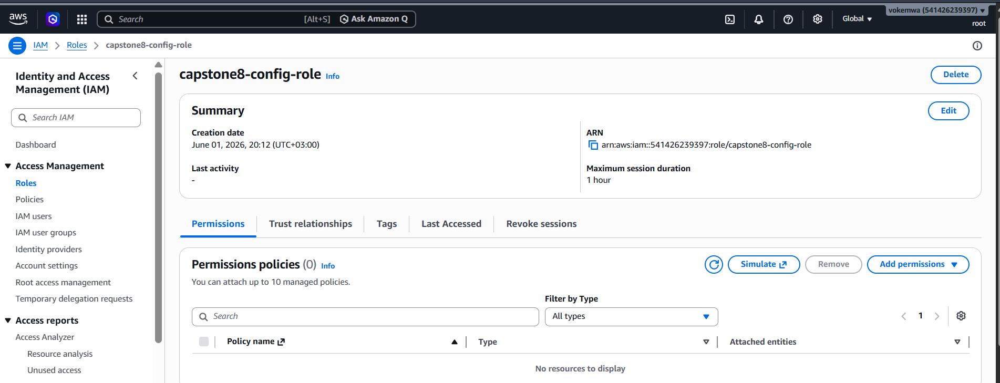

# S3 Bucket creation
Created a bucket named `capstone8-config-bucket`

# IAM Security Policies
For this project, we must satisfy the least-privilege constraints by avoiding administrative roles for individual services.
Create files named `config-trust-policy.json`, `config-s3-policy.json`, `lambda-trust-policy.json`, `lambda-permissions-policy.json`, `stepfunctions-trust-policy.json`, `stepfunctions-permissions-policy.json` in the vs code folder

# Creating Config IAM role capstone8-config-role

`aws iam create-role`
  `--role-name capstone8-config-role `
  `--assume-role-policy-document file://config-trust-policy.json`

# 