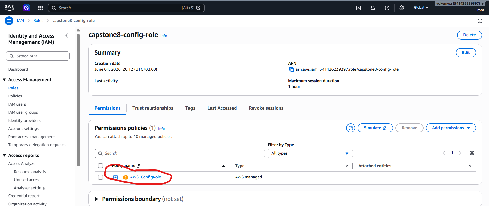
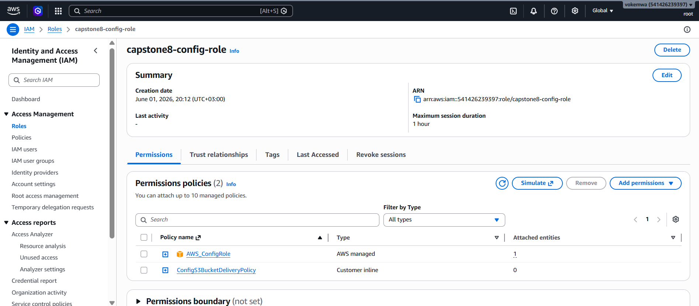
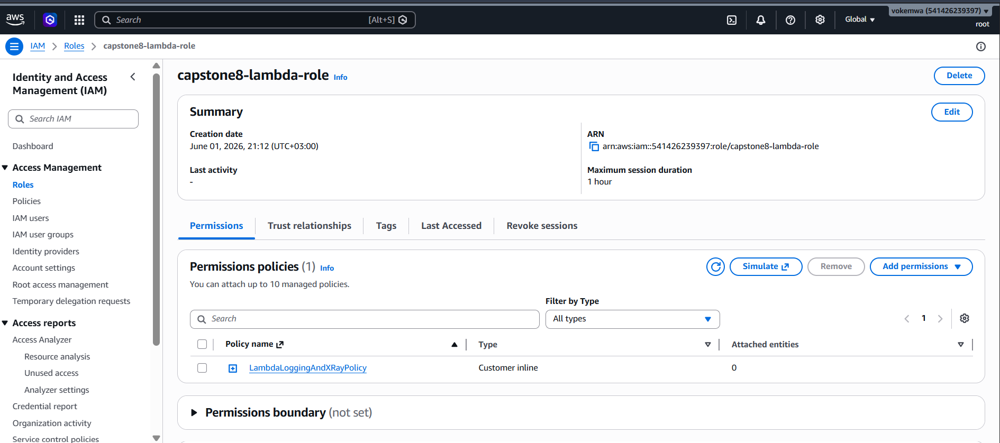
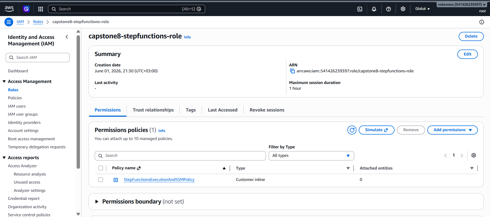
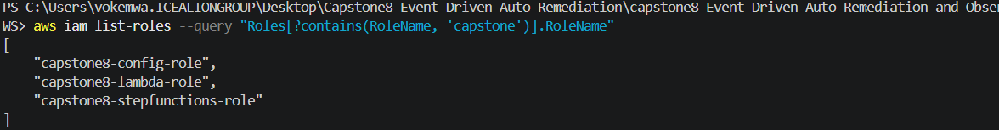

# S3 Bucket creation
Created a bucket named `capstone8-config-bucket`

# IAM Security Policies
For this project, we must satisfy the least-privilege constraints by avoiding administrative roles for individual services.
Create files named `config-trust-policy.json`, `config-s3-policy.json`, `lambda-trust-policy.json`, `lambda-permissions-policy.json`, `stepfunctions-trust-policy.json`, `stepfunctions-permissions-policy.json` in the vs code folder

# Create and Configure the AWS Config Role
## Creating Config IAM role capstone8-config-role using trust policy

`aws iam create-role`
  `--role-name capstone8-config-role `
  `--assume-role-policy-document file://config-trust-policy.json`

## Attach AWS Managed policy for general Config operations

`aws iam attach-role-policy 
  --role-name capstone8-config-role
  --policy-arn arn:aws:iam::aws:policy/service-role/AWS_ConfigRole`

  

  ## Attach your custom local S3 policy file for bucket access
  
  `aws iam put-role-policy
  --role-name capstone-config-role
  --policy-name ConfigS3BucketDeliveryPolicy
  --policy-document file://config-s3-policy.json`

  

# Create and Configure the Lambda Execution Role

## 1. Create the Lambda Role using the trust policy
aws iam create-role`
  --role-name capstone-lambda-role`
  --assume-role-policy-document file://lambda-trust-policy.json

  ## 2. Attach the logging and X-Ray debugging permissions to the role
aws iam put-role-policy `
  --role-name capstone8-lambda-role `
  --policy-name LambdaLoggingAndXRayPolicy `
  --policy-document file://lambda-permissions-policy.json

  

# Create and Configure the Step Functions Role

## 1. Create the Step Functions Role using the trust policy
aws iam create-role `
  --role-name capstone-stepfunctions-role `
  --assume-role-policy-document file://stepfunctions-trust-policy.json

## 2. Attach the execution and remediation automation privileges
aws iam put-role-policy `
  --role-name capstone-stepfunctions-role `
  --policy-name StepFunctionsExecutionAndSSMPolicy `
  --policy-document file://stepfunctions-permissions-policy.json

  

 # Confirm the roles exist
  

  # Set environment context variables for current session shell
   `export AWS_REGION="us-east-1"`
   `export ACCOUNT_ID="541426239397"`

   # AWS Config Initialization

   `aws configservice put-configuration-recorder \
     --configuration-recorder name=default,roleARN=arn:aws:iam::${ACCOUNT_ID}:role/capstone-config-role \
     --recording-group allSupported=true`

   `aws s3 mb s3://capstone-config-bucket-${ACCOUNT_ID} --region ${AWS_REGION}`

   `aws configservice put-delivery-channel \
  --delivery-channel name=default,s3BucketName=capstone-config-bucket-${ACCOUNT_ID}`

  `aws configservice start-configuration-recorder \
  --configuration-recorder-name default`

  